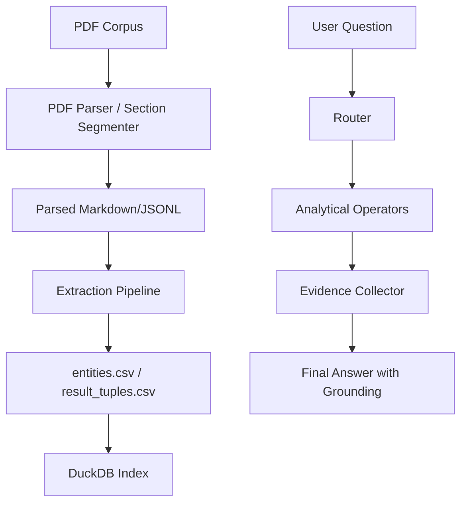

# AIGC Fake Detection: Analytical Research QA Engine

A high-fidelity, deterministic question-answering system designed to synthesize and audit the research corpus of AIGC (AI-Generated Content) fake detection.

## Project Purpose

This project implements a "Good At Numbers" analytical engine that extracts entities (datasets, models, metrics) and result tuples from a corpus of 100 research papers. Unlike standard RAG systems, it uses an operator-based architecture to provide auditable, evidence-backed answers to complex research queries without the risk of LLM hallucinations.

## Architecture Overview

The system follows a tiered analytical pipeline:
1. **Extraction (Day 5)**: Rule-based parsing of Markdown sections and tables into structured CSVs and a DuckDB index.
2. **Routing (Day 6)**: A regex-based intent classifier that maps natural language questions to specialized analytical operators.
3. **Operators**: Deterministic logic (Pandas/SQL) for Single-Doc facts, Multi-Doc aggregations, Temporal trends, and Contradiction detection.
4. **Evidence (Day 6.5)**: A snippet retrieval layer that fetches precise grounding text from the original parsed sections.

## Data Flow



## Setup Instructions

### Prerequisites
- Python 3.10+
- Google Colab (recommended for full extraction runs)

### Installation
```bash
git clone https://github.com/IanJ332/AIGC_Fake_Detection.git
cd AIGC_Fake_Detection
pip install -r requirements.txt
```

## Google Drive Data Layout

The system expects the following structure (mirrored in Colab):
```
/content/drive/MyDrive/AIGC/Data/
├── registry/
│   ├── manifest_100.csv
│   └── document_registry.csv
├── extracted/
│   ├── entities.csv
│   ├── result_tuples.csv
│   └── paper_entity_summary.csv
├── sections/
│   └── sections.jsonl
└── index/
    └── research_corpus.duckdb
```

## Usage

### Run Extraction (Day 5)
Extraction is typically performed in Colab using `notebooks/03_full_extraction_runner.ipynb`.

### Run QA CLI
```bash
python -m src.query.cli --data-dir ./Data --question "What are the top 10 datasets mentioned across the corpus?"
```

### Run Evaluation
```bash
# Reruns evaluation on existing data bundle; does not regenerate PDFs or extracted data.
python eval/run_eval.py --data-dir ./Data --questions eval/questions_40.jsonl
```

## Performance & Evaluation

- **Routing Accuracy**: 92.5%
- **Operator Success**: 100%
- **Evidence Coverage**: ~53% (strictly grounded snippets)
- **Unknown Tier Count**: 0

Detailed metrics are available in [docs/quality_vs_budget.md](docs/quality_vs_budget.md).

## Known Limitations

- Only 72 PDFs were successfully parsed due to publisher 403 restrictions.
- Citation graph analysis is limited to metadata-based links.
- Results are heuristic candidates and should be cross-verified with source snippets.
- For full details, see [docs/limitations.md](docs/limitations.md).

## Submitted Artifacts

To maintain a lightweight and efficient repository, the full runtime data (PDFs, DuckDB, parsed JSONL) is intentionally excluded from version control. However, a curated set of lightweight evidence artifacts is included under the `artifacts/` directory for audit and review:

- **Reports**: Day 5 extraction logs and Day 6 evaluation summaries.
- **Manifests**: Registry files for the 100-paper corpus and parsing results.
- **Samples**: Representative CSV samples of the extracted entities and results.
- **Inventory**: A high-level summary of the full local data scale (`artifacts/data_inventory_summary.md`).

The full data can be inspected in the Google Drive runtime environment or regenerated via the provided notebooks if the source PDF bundle is provided.

## Cost Report
Total estimated spend for this project: **$0.00**.
See [docs/cost_report.md](docs/cost_report.md) for details.